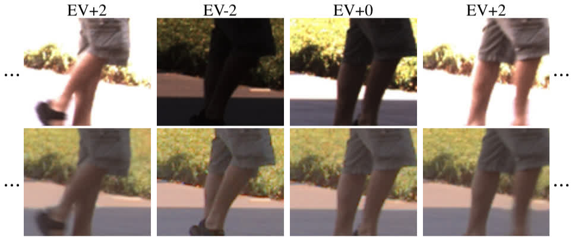

# Code for HDR Video Reconstruction

**[HDR Video Reconstruction: A Coarse-to-fine Network and A Real-world Benchmark Dataset (ICCV 2021)](http://guanyingc.github.io/DeepHDRVideo/)**
<br>
[Guanying Chen](https://guanyingc.github.io), 
[Chaofeng Chen](http://chaofengc.github.io/),
[Shi Guo](https://scholar.google.com/citations?user=5hsEmuQAAAAJ&hl=en),
[Zhetong Liang](https://scholar.google.com/citations?user=fCnuU9YAAAAJ&hl=en),
[Kwan-Yee K. Wong](http://i.cs.hku.hk/~kykwong/),
[Lei Zhang](https://www4.comp.polyu.edu.hk/~cslzhang/)
<br>

<p align="left">
    
</p>

<!--
## TODO:
- Precomputed results
- Prepare baiduyun
-->

## Table of Contents
* [Overview:](#overview)
  * [Dependencies](#dependencies)
* [Testing](#testing)
  * [Testing on the synthetic test dataset](#testing-on-the-synthetic-test-dataset)
  * [Testing on the TOG13 dataset](#testing-on-the-tog13-dataset)
  * [Testing on the captured static dataset](#testing-on-the-captured-static-dataset)
  * [Testing on the captured dynamic with GT dataset](#testing-on-the-captured-dynamic-with-gt-dataset)
  * [Testing on the captured dynamic without GT dataset](#testing-on-the-captured-dynamic-without-gt-dataset)
  * [Testing on the customized dataset](#testing-on-the-customized-dataset)
  * [HDR evaluation metrics](#hdr-evaluation-metrics)
  * [Tonemapping](#tonemapping)
  * [Precomputed results](#precomputed-results)
* [Training](#training)
* [License](#license)
* [Citation](#citation)

## Overview:
We provide testing and training codes.
Details of the training and testing dataset can be found in [DeepHDRVideo-Dataset](https://guanyingc.github.io/DeepHDRVideo-Dataset/).
Datasets, the trained models, and the computed results can be download in [BaiduYun](https://pan.baidu.com/s/19SkOFmOdlQTujuazMlUq2Q?pwd=xwmq).

### Dependencies
This method is implemented in [PyTorch](https://pytorch.org/) and tested with Ubuntu (14.04 and 16.04) and Centos 7. 
- Python 3.7 
- PyTorch 1.10 and torchvision 0.30

You are highly recommended to use Anaconda and create a new environment to run this code. The following is an example procedure to install the dependencies.

```shell
# Create a new python3.7 environment named hdr
conda create -n hdr python=3.7

# Activate the created environment
source activate hdr

pip install -r requirements.txt

# Build deformable convolutional layer, tested with PyTorch 1.1, g++5.5, and Cuda 9.0
cd extensions/dcn/
python setup.py develop
# Please refer to https://github.com/xinntao/EDVR if you have difficulty in building this module
```

## Testing
Please first go through [DeepHDRVideo-Dataset](https://guanyingc.github.io/DeepHDRVideo-Dataset/) to familiarize yourself with the testing dataset.

The trained models can be found in BaiduYun (`Models/`). Download and place it to `data/models/`.

### Testing on the synthetic test dataset
The synthetic test dataset can be found in BaiduYun (`/Synthetic_Dataset/HDR_Synthetic_Test_Dataset.tgz`). Download and unzip it to `data/`. Note that we donot perform global motion alignment for this synthetic dataset.
```shell
# Test our method on two-exposure data. Results can be found in data/models/CoarseToFine_2Exp/
python run_model.py --gpu_ids 0 --model hdr2E_flow2s_model \
    --benchmark syn_test_dataset --bm_dir data/HDR_Synthetic_Test_Dataset \
    --mnet_name weight_net --mnet_checkp data/models/CoarseToFine_2Exp/weight_net.pth --fnet_checkp data/models/CoarseToFine_2Exp/flow_net.pth --mnet2_checkp data/models/CoarseToFine_2Exp/refine_net.pth

# Test our method on three-exposure data. The results can be found in data/models/CoarseToFine_3Exp/
python run_model.py --gpu_ids 0 --model hdr3E_flow2s_model \
    --benchmark syn_test_dataset --bm_dir data/HDR_Synthetic_Test_Dataset \
    --mnet_name weight_net --mnet_checkp data/models/CoarseToFine_3Exp/weight_net.pth --fnet_checkp data/models/CoarseToFine_3Exp/flow_net.pth --mnet2_checkp data/models/CoarseToFine_3Exp/refine_net.pth
```

### Testing on the TOG13 dataset
Please download this dataset from `TOG13_Dynamic_Dataset.tgz` and unzip to `data/`. Normally when testing on a video, we have to first compute the similarity transformation matrices between neighboring frames using the following commands.
```shell
# However, this is optional as the downloaded dataset already contains the required transformation matrices for each scene in Affine_Trans_Matrices/.
python utils/compute_nbr_trans_for_video.py --in_dir data/TOG13_Dynamic_Dataset/ --crf data/TOG13_Dynamic_Dataset/BaslerCRF.mat --scene_list 2Exp_scenes.txt
python utils/compute_nbr_trans_for_video.py --in_dir data/TOG13_Dynamic_Dataset/ --crf data/TOG13_Dynamic_Dataset/BaslerCRF.mat --scene_list 3Exp_scenes.txt
```

```shell
# Test our method on two-exposure data. The results can be found in data/models/CoarseToFine_2Exp/
# Specify the testing scene with --test_scene. Available options are Ninja-2Exp-3Stop WavingHands-2Exp-3Stop Skateboarder2-3Exp-2Stop ThrowingTowel-2Exp-3Stop 
python run_model.py --gpu_ids 0 --model hdr2E_flow2s_model \
    --benchmark tog13_online_align_dataset --bm_dir data/TOG13_Dynamic_Dataset --test_scene ThrowingTowel-2Exp-3Stop --align \ --mnet_name weight_net --fnet_checkp data/models/CoarseToFine_2Exp/flow_net.pth --mnet_checkp data/models/CoarseToFine_2Exp/weight_net.pth --mnet2_checkp data/models/CoarseToFine_2Exp/refine_net.pth 
# To test on a specific scene, you can use the --test_scene argument, e.g., "--test_scene ThrowingTowel-2Exp-3Stop".

# Test our method on three-exposure data. The results can be found in data/models/CoarseToFine_3Exp/
# Specify the testing scene with --test_scene. Available options are Cleaning-3Exp-2Stop Dog-3Exp-2Stop CheckingEmail-3Exp-2Stop Fire-2Exp-3Stop
python run_model.py --gpu_ids 0 --model hdr3E_flow2s_model \
    --benchmark tog13_online_align_dataset --bm_dir data/TOG13_Dynamic_Dataset --test_scene Dog-3Exp-2Stop --align \
    --mnet_name weight_net --fnet_checkp data/models/CoarseToFine_3Exp/flow_net.pth --mnet_checkp data/models/CoarseToFine_3Exp/weight_net.pth --mnet2_checkp data/models/CoarseToFine_3Exp/refine_net.pth 
```

### Testing on the captured static dataset
The global motion augmented static dataset can be found in BaiduYun (`/Real_Dataset/Static/`).
```shell
# Test our method on two-exposure data. Download static_RGB_data_2exp_rand_motion_release.tgz and unzip to data/
# Results can be found in data/models/CoarseToFine_2Exp/
python run_model.py --gpu_ids 0 --model hdr2E_flow2s_model \
    --benchmark real_benchmark_dataset --bm_dir data/static_RGB_data_2exp_rand_motion_release --test_scene all \
    --mnet_name weight_net --mnet_checkp data/models/CoarseToFine_2Exp/weight_net.pth --fnet_checkp data/models/CoarseToFine_2Exp/flow_net.pth --mnet2_checkp data/models/CoarseToFine_2Exp/refine_net.pth

# Test our method on three-exposure data. Download static_RGB_data_3exp_rand_motion_release.tgz and unzip to data/
# The results can be found in data/models/CoarseToFine_3Exp/
python run_model.py --gpu_ids 0 --model hdr3E_flow2s_model \
    --benchmark real_benchmark_dataset --bm_dir data/static_RGB_data_3exp_rand_motion_release --test_scene all \
    --mnet_name weight_net --mnet_checkp data/models/CoarseToFine_3Exp/weight_net.pth --fnet_checkp data/models/CoarseToFine_3Exp/flow_net.pth --mnet2_checkp data/models/CoarseToFine_3Exp/refine_net.pth
```

### Testing on the captured dynamic with GT dataset
The dynamic with GT dataset can be found in BaiduYun (`/Real_Dataset/Dynamic/`).
```shell
# Test our method on two-exposure data. Download dynamic_RGB_data_2exp_release.tgz and unzip to data/
python run_model.py --gpu_ids 0 --model hdr2E_flow2s_model \
    --benchmark real_benchmark_dataset --bm_dir data/dynamic_RGB_data_2exp_release --test_scene all \
    --mnet_name weight_net  --fnet_checkp data/models/CoarseToFine_2Exp/flow_net.pth --mnet_checkp data/models/CoarseToFine_2Exp/weight_net.pth --mnet2_checkp data/models/CoarseToFine_2Exp/refine_net.pth

# Test our method on three-exposure data. Download dynamic_RGB_data_3exp_release.tgz and unzip to data/
python run_model.py --gpu_ids 0 --model hdr3E_flow2s_model \
    --benchmark real_benchmark_dataset --bm_dir data/dynamic_RGB_data_3exp_release --test_scene all \
    --mnet_name weight_net  --fnet_checkp data/models/CoarseToFine_3Exp/flow_net.pth --mnet_checkp data/models/CoarseToFine_3Exp/weight_net.pth --mnet2_checkp data/models/CoarseToFine_3Exp/refine_net.pth
```

### Testing on the captured dynamic without GT dataset
The dynamic with GT dataset can be found in BaiduYun (`/Real_Dataset/Dynamic_noGT/`).
```shell
# Test our method on two-exposure data. Download dynamic_data_noGT_2exp_RGB_JPG.tgz and unzip to data/
# Note that we provide the JPG dataset only for illustrating the testing process
# Results can be found in data/models/CoarseToFine_2Exp/
python run_model.py --gpu_ids 0 --model hdr2E_flow2s_model \
    --benchmark real_benchmark_dataset --bm_dir data/dynamic_data_noGT_2exp_RGB_JPG --test_scene all \
    --mnet_name weight_net --mnet_checkp data/models/CoarseToFine_2Exp/weight_net.pth --fnet_checkp data/models/CoarseToFine_2Exp/flow_net.pth --mnet2_checkp data/models/CoarseToFine_2Exp/refine_net.pth
# It is similar to test on three-exposure data
```

### Testing on the customized dataset 
You have two options to test our method on your dataset. In the first option, you have to implement a customized Dataset class to load your data, which should not be difficult. Please refer to `datasets/tog13_online_align_dataset.py`.

If you don't want to implement your own Dataset class, you may reuse `datasets/tog13_online_align_dataset.py`. However, you have to first arrange your dataset similar to the TOG13 dataset.
Then you can run `utils/compute_nbr_trans_for_video.py` to compute the similarity transformation matrices between neighboring frames to enable global alignment.
```
# Use gamma curve if you do not know the camera response function
python utils/compute_nb_transformation_video.py --in_dir /path/to/your/dataset/ --crf gamma --scene_list your_scene_list
```

### HDR evaluation metrics
We evaluate PSRN, HDR-VDP, HDR-VQM metrics using the Matlab code. Please first install [HDR Toolbox](https://github.com/banterle/HDR_Toolbox) to read HDR. Then set the paths of the ground-truth HDR and the estimated HDR in `matlab/config_eval.m`. Last, run `main_eval.m` in the Matlab console in the directory of `matlab/`.
```
main_eval(2, 'Ours')
main_eval(3, 'Ours')
```

### Tonemapping
All visual results in the experiment are tonemapped using Reinhard et al.’s method. Please first install [luminance-hdr-cli](https://luminancehdr.readthedocs.io/en/latest/creating_hdr/command_line/). In Ubuntu, you may use `sudo apt-get install -y luminance-hdr` to install it. Then you can use the following command to produce the tonemmapped results.
```
python utils/tonemapper.py -i /path/to/HDR/
```

### Precomputed results
The precomputed results can be found in BaiduYun (`/Results`).

## Training
The training process is described in [docs/training.md](docs/training.md).

## License

<a rel="license" href="http://creativecommons.org/licenses/by-nc-sa/4.0/"></a><br />This work is licensed under a <a rel="license" href="http://creativecommons.org/licenses/by-nc-sa/4.0/">Creative Commons Attribution-NonCommercial-ShareAlike 4.0 International License</a>.

## Citation
If you find this code useful in your research, please consider citing: 
```
@article{chen2021hdr,
  title={{HDR} Video Reconstruction: A Coarse-to-fine Network and A Real-world Benchmark Dataset},
  author={Chen, Guanying and Chen, Chaofeng and Guo, Shi and Liang, Zhetong and Wong, Kwan-Yee~K. and Zhang, Lei},
  journal=ICCV,
  year={2021}
}
```

